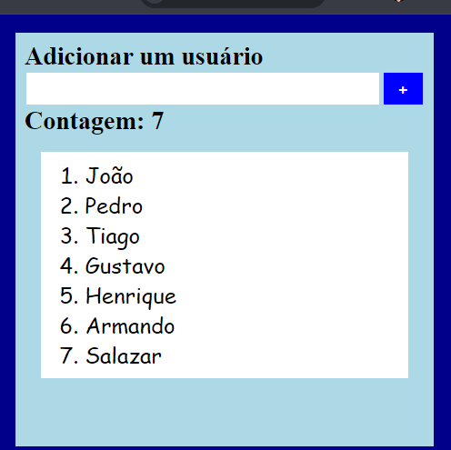

# React App: component life cicle

### `npm run start`

1. Digige um nome de usuário na caixa de texto : Validação o comprimento do nome deve ser maior ou igual a 3.
2. Clique no botão adicionar.
3. O contador e o elemento lista enumerada devem ser atualizados a cada nome adicionado.

